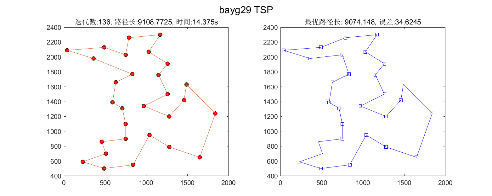
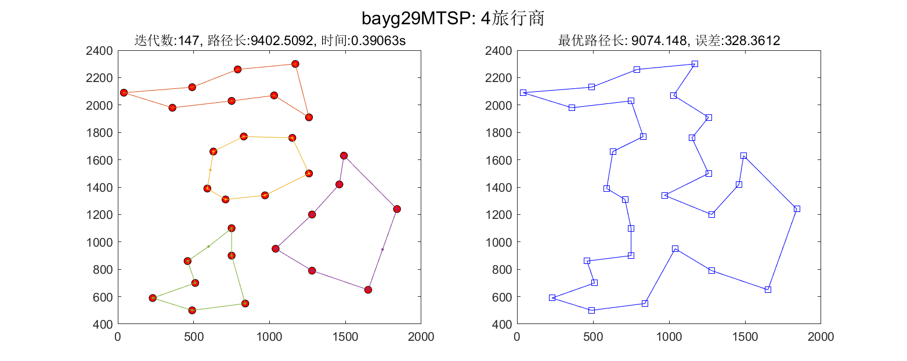

# SOM-TSP
Using som to solve tsp and mtsp problems, implemented in Matlab.  
**PLEASE CITE THIS PAGE WHEN YOU USE THE CODE FOR HOMEWORK**

# Results
TSP:

MTSP:

# Reference
[1] Somhom S, Modares A, Enkawa T. Competition-based neural network for the multiple travelling salesmen problem with minmax objective[J]. Computers & Operations Research, 1999, 26(4): 395-407.  
[2] SOM-MTSP Python: https://github.com/mateuszzawadzki/som-mtsp